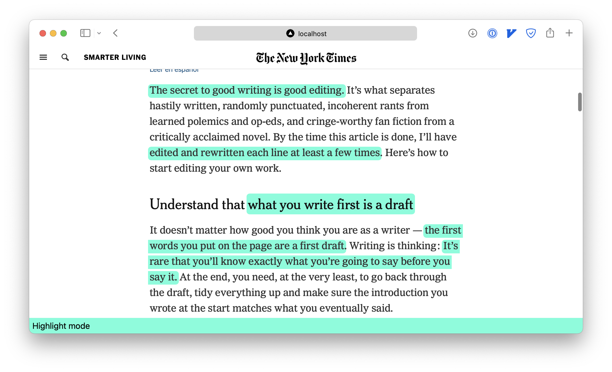

# Highlighter Anywhere



To open the highlighter, append `<your-domain>` before any url, for example:

```
https://localhost:300/<url>

http://localhost:3000/https://www.nytimes.com/2020/04/07/smarter-living/how-to-edit-your-own-writing.html
```

Currently, make a selection will automatically highlight the content, click on the
highlighted text will show a confirmation dialog to remove the highlight.
